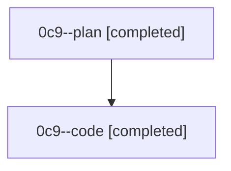

# Family: 0c9

[Agent Hoods](../README.md) / [bbugyi200](../users/bbugyi200/README.md) / [athena](../users/bbugyi200/machines/athena/README.md) / [0c9](../users/bbugyi200/machines/athena/hoods/0c9/README.md) / 0c9

Owner: `bbugyi200.athena` · Hood: `0c9` · Members: 2

## Lineage

The diagram is an optional enhancement; the ordered table below contains the same lineage in accessible text.

| Role | Agent | State | Model / provider | Timing | Commits | Prompt | Chat |
|---|---|---|---|---|---:|---|---|
| plan | 0c9--plan | completed | opus / claude | 2026-08-24T11:20:01.541328+00:00 → 2026-08-24T11:47:31.225323+00:00 | 0 | [Prompt](../agents/bbugyi200.athena.0c9--plan/prompt.md) | [Chat](../agents/bbugyi200.athena.0c9--plan/chat.md) |
| code | 0c9--code | completed | gpt-5.5 / codex | 2026-08-24T11:34:08.033829+00:00 → 2026-08-24T11:47:31.225323+00:00 | 0 | — | [Chat](../agents/bbugyi200.athena.0c9--code/chat.md) |

## Neighbors

| Agent | Relation | State |
|---|---|---|
| [0c9.w0](bbugyi200.athena.0c9.w0.md) (family · 2) | descendant | failed 2 |
