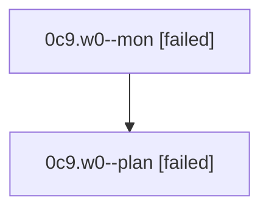

# Family: 0c9.w0

[Agent Hoods](../README.md) / [bbugyi200](../users/bbugyi200/README.md) / [athena](../users/bbugyi200/machines/athena/README.md) / [0c9](../users/bbugyi200/machines/athena/hoods/0c9/README.md) / 0c9.w0

Owner: `bbugyi200.athena` · Hood: `0c9` · Members: 2

## Lineage

The diagram is an optional enhancement; the ordered table below contains the same lineage in accessible text.

| Role | Agent | State | Model / provider | Timing | Commits | Prompt | Chat |
|---|---|---|---|---|---:|---|---|
| mon | 0c9.w0--mon | failed | gpt-5.6-sol / codex | 2026-08-24T11:57:13.710693+00:00 | 0 | — | [Chat](../agents/bbugyi200.athena.0c9.w0--mon/chat.md) |
| plan | 0c9.w0--plan | failed | gpt-5.6-sol / codex | 2026-08-24T11:47:51.310200+00:00 → 2026-08-24T11:57:10.628486+00:00 | 0 | [Prompt](../agents/bbugyi200.athena.0c9.w0--plan/prompt.md) | [Chat](../agents/bbugyi200.athena.0c9.w0--plan/chat.md) |

## Neighbors

| Agent | Relation | State |
|---|---|---|
| [0c9](bbugyi200.athena.0c9.md) (family · 2) | ancestor | completed 2 |
