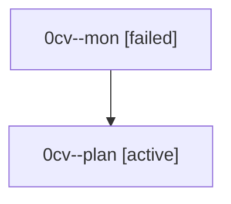

# Family: 0cv

[Agent Hoods](../README.md) / [bbugyi200](../users/bbugyi200/README.md) / [athena](../users/bbugyi200/machines/athena/README.md) / [0cv](../users/bbugyi200/machines/athena/hoods/0cv/README.md) / 0cv

Owner: `bbugyi200.athena` · Hood: `0cv` · Members: 2

## Lineage

The diagram is an optional enhancement; the ordered table below contains the same lineage in accessible text.

| Role | Agent | State | Model / provider | Timing | Commits | Prompt | Chat |
|---|---|---|---|---|---:|---|---|
| mon | 0cv--mon | failed | opus / claude | 2026-08-24T19:01:37.019128+00:00 | 0 | — | [Chat](../agents/bbugyi200.athena.0cv--mon/chat.md) |
| plan | 0cv--plan | active | opus / claude | 2026-08-24T18:44:12.910740+00:00 | 0 | [Prompt](../agents/bbugyi200.athena.0cv--plan/prompt.md) | [Chat](../agents/bbugyi200.athena.0cv--plan/chat.md) |
