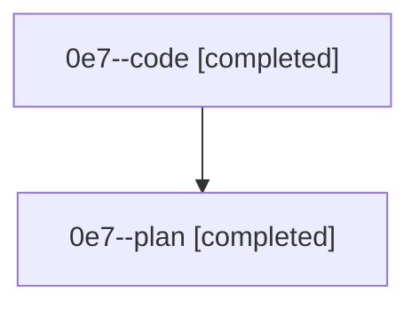

# Family: 0e7

[Agent Hoods](../README.md) / [bbugyi200](../users/bbugyi200/README.md) / [athena](../users/bbugyi200/machines/athena/README.md) / [0e7](../users/bbugyi200/machines/athena/hoods/0e7/README.md) / 0e7

Owner: `bbugyi200.athena` · Hood: `0e7` · Members: 2

## Lineage

The diagram is an optional enhancement; the ordered table below contains the same lineage in accessible text.

| Role | Agent | State | Model / provider | Timing | Commits | Prompt | Chat |
|---|---|---|---|---|---:|---|---|
| code | 0e7--code | completed | sonnet / claude | 2026-08-26T12:14:58.313162+00:00 → 2026-08-26T12:18:40.779488+00:00 | 0 | — | [Chat](../agents/bbugyi200.athena.0e7--code/chat.md) |
| plan | 0e7--plan | completed | opus / claude | 2026-08-26T12:02:18.660300+00:00 → 2026-08-26T12:18:40.779488+00:00 | 0 | [Prompt](../agents/bbugyi200.athena.0e7--plan/prompt.md) | [Chat](../agents/bbugyi200.athena.0e7--plan/chat.md) |
