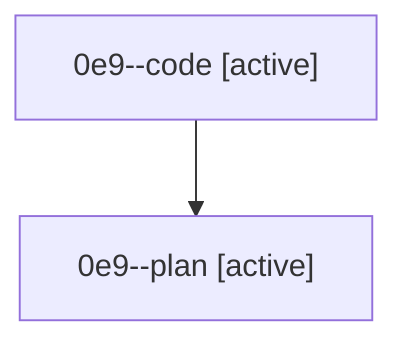

# Family: 0e9

[Agent Hoods](../README.md) / [bbugyi200](../users/bbugyi200/README.md) / [athena](../users/bbugyi200/machines/athena/README.md) / [0e9](../users/bbugyi200/machines/athena/hoods/0e9/README.md) / 0e9

Owner: `bbugyi200.athena` · Hood: `0e9` · Members: 2

## Lineage

The diagram is an optional enhancement; the ordered table below contains the same lineage in accessible text.

| Role | Agent | State | Model / provider | Timing | Commits | Prompt | Chat |
|---|---|---|---|---|---:|---|---|
| code | 0e9--code | active | sonnet / claude | 2026-08-26T13:48:11.938742+00:00 | 0 | — | — |
| plan | 0e9--plan | active | gpt-5.6-sol / codex | 2026-08-26T13:43:56.766888+00:00 | 0 | [Prompt](../agents/bbugyi200.athena.0e9--plan/prompt.md) | [Chat](../agents/bbugyi200.athena.0e9--plan/chat.md) |
