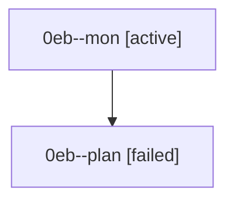

# Family: 0eb

[Agent Hoods](../README.md) / [bbugyi200](../users/bbugyi200/README.md) / [athena](../users/bbugyi200/machines/athena/README.md) / [0eb](../users/bbugyi200/machines/athena/hoods/0eb/README.md) / 0eb

Owner: `bbugyi200.athena` · Hood: `0eb` · Members: 2

## Lineage

The diagram is an optional enhancement; the ordered table below contains the same lineage in accessible text.

| Role | Agent | State | Model / provider | Timing | Commits | Prompt | Chat |
|---|---|---|---|---|---:|---|---|
| mon | 0eb--mon | active | opus / claude | 2026-08-26T14:04:10.438676+00:00 | 0 | — | — |
| plan | 0eb--plan | failed | opus / claude | 2026-08-26T13:53:37.462796+00:00 → 2026-08-26T14:04:08.808948+00:00 | 0 | [Prompt](../agents/bbugyi200.athena.0eb--plan/prompt.md) | [Chat](../agents/bbugyi200.athena.0eb--plan/chat.md) |
