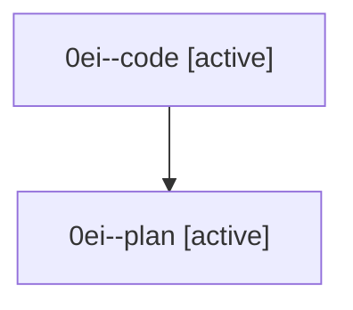

# Family: 0ei

[Agent Hoods](../README.md) / [bbugyi200](../users/bbugyi200/README.md) / [athena](../users/bbugyi200/machines/athena/README.md) / [0ei](../users/bbugyi200/machines/athena/hoods/0ei/README.md) / 0ei

Owner: `bbugyi200.athena` · Hood: `0ei` · Members: 2

## Lineage

The diagram is an optional enhancement; the ordered table below contains the same lineage in accessible text.

| Role | Agent | State | Model / provider | Timing | Commits | Prompt | Chat |
|---|---|---|---|---|---:|---|---|
| code | 0ei--code | active | sonnet / claude | 2026-08-26T18:39:47.912831+00:00 | 0 | — | — |
| plan | 0ei--plan | active | gpt-5.6-sol / codex | 2026-08-26T18:33:15.821468+00:00 | 0 | [Prompt](../agents/bbugyi200.athena.0ei--plan/prompt.md) | [Chat](../agents/bbugyi200.athena.0ei--plan/chat.md) |
