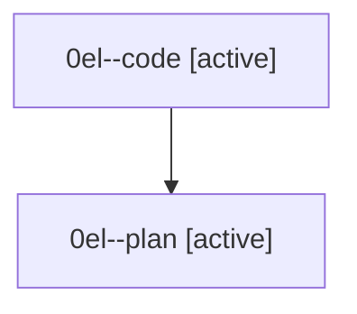

# Family: 0el

[Agent Hoods](../README.md) / [bbugyi200](../users/bbugyi200/README.md) / [athena](../users/bbugyi200/machines/athena/README.md) / [0el](../users/bbugyi200/machines/athena/hoods/0el/README.md) / 0el

Owner: `bbugyi200.athena` · Hood: `0el` · Members: 2

## Lineage

The diagram is an optional enhancement; the ordered table below contains the same lineage in accessible text.

| Role | Agent | State | Model / provider | Timing | Commits | Prompt | Chat |
|---|---|---|---|---|---:|---|---|
| code | 0el--code | active | sonnet / claude | 2026-08-26T23:11:17.515775+00:00 | 0 | — | — |
| plan | 0el--plan | active | opus / claude | 2026-08-26T22:58:40.433695+00:00 | 0 | [Prompt](../agents/bbugyi200.athena.0el--plan/prompt.md) | [Chat](../agents/bbugyi200.athena.0el--plan/chat.md) |
