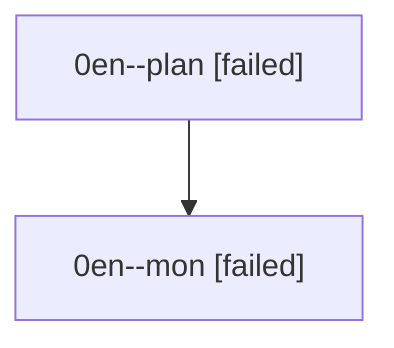

# Family: 0en

[Agent Hoods](../README.md) / [bbugyi200](../users/bbugyi200/README.md) / [athena](../users/bbugyi200/machines/athena/README.md) / [0en](../users/bbugyi200/machines/athena/hoods/0en/README.md) / 0en

Owner: `bbugyi200.athena` · Hood: `0en` · Members: 2

## Lineage

The diagram is an optional enhancement; the ordered table below contains the same lineage in accessible text.

| Role | Agent | State | Model / provider | Timing | Commits | Prompt | Chat |
|---|---|---|---|---|---:|---|---|
| plan | 0en--plan | failed | opus / claude | 2026-08-27T12:00:52.965796+00:00 → 2026-08-27T12:13:29.269301+00:00 | 0 | [Prompt](../agents/bbugyi200.athena.0en--plan/prompt.md) | [Chat](../agents/bbugyi200.athena.0en--plan/chat.md) |
| mon | 0en--mon | failed | opus / claude | 2026-08-27T12:13:31.665952+00:00 | 0 | — | [Chat](../agents/bbugyi200.athena.0en--mon/chat.md) |
