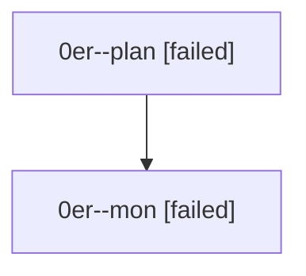

# Family: 0er

[Agent Hoods](../README.md) / [bbugyi200](../users/bbugyi200/README.md) / [athena](../users/bbugyi200/machines/athena/README.md) / [0er](../users/bbugyi200/machines/athena/hoods/0er/README.md) / 0er

Owner: `bbugyi200.athena` · Hood: `0er` · Members: 2

## Lineage

The diagram is an optional enhancement; the ordered table below contains the same lineage in accessible text.

| Role | Agent | State | Model / provider | Timing | Commits | Prompt | Chat |
|---|---|---|---|---|---:|---|---|
| plan | 0er--plan | failed | gpt-5.6-sol / codex | 2026-08-27T13:35:22.994545+00:00 → 2026-08-27T13:54:37.963937+00:00 | 0 | [Prompt](../agents/bbugyi200.athena.0er--plan/prompt.md) | [Chat](../agents/bbugyi200.athena.0er--plan/chat.md) |
| mon | 0er--mon | failed | gpt-5.6-sol / codex | 2026-08-27T13:54:53.276300+00:00 | 0 | — | [Chat](../agents/bbugyi200.athena.0er--mon/chat.md) |
