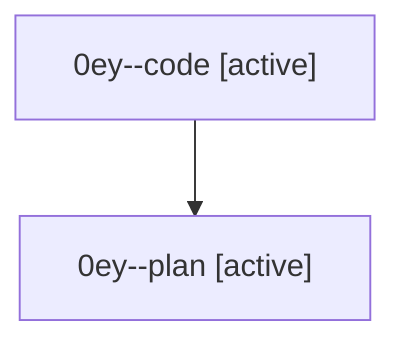

# Family: 0ey

[Agent Hoods](../README.md) / [bbugyi200](../users/bbugyi200/README.md) / [athena](../users/bbugyi200/machines/athena/README.md) / [0ey](../users/bbugyi200/machines/athena/hoods/0ey/README.md) / 0ey

Owner: `bbugyi200.athena` · Hood: `0ey` · Members: 2

## Lineage

The diagram is an optional enhancement; the ordered table below contains the same lineage in accessible text.

| Role | Agent | State | Model / provider | Timing | Commits | Prompt | Chat |
|---|---|---|---|---|---:|---|---|
| code | 0ey--code | active | gpt-5.5 / codex | 2026-08-27T15:52:28.085703+00:00 | 0 | — | — |
| plan | 0ey--plan | active | opus / claude | 2026-08-27T15:39:44.205561+00:00 | 0 | [Prompt](../agents/bbugyi200.athena.0ey--plan/prompt.md) | [Chat](../agents/bbugyi200.athena.0ey--plan/chat.md) |

## Neighbors

| Agent | Relation | State |
|---|---|---|
| [0ey.f0](../agents/bbugyi200.athena.0ey.f0/README.md) | descendant | dismissed |
| [0ey.f1](../agents/bbugyi200.athena.0ey.f1/README.md) | descendant | waiting |
