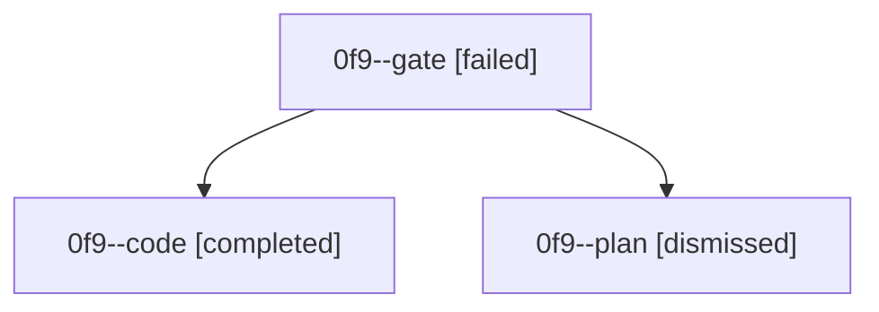

# Family: 0f9

[Agent Hoods](../README.md) / [bbugyi200](../users/bbugyi200/README.md) / [athena](../users/bbugyi200/machines/athena/README.md) / [0f9](../users/bbugyi200/machines/athena/hoods/0f9/README.md) / 0f9

Owner: `bbugyi200.athena` · Hood: `0f9` · Members: 3

## Lineage

The diagram is an optional enhancement; the ordered table below contains the same lineage in accessible text.

| Role | Agent | State | Model / provider | Timing | Commits | Prompt | Chat |
|---|---|---|---|---|---:|---|---|
| gate | 0f9--gate | failed | gpt-5.6-sol / codex | 2026-08-27T23:04:24.792156+00:00 → 2026-08-27T23:12:18.966093+00:00 | 0 | — | [Chat](../agents/bbugyi200.athena.0f9--gate/chat.md) |
| code | 0f9--code | completed | gpt-5.5 / codex | 2026-08-27T23:12:27.478937+00:00 → 2026-08-27T23:26:27.650906+00:00 | [1](../agents/bbugyi200.athena.0f9--code/README.md#commits) | [Prompt](../agents/bbugyi200.athena.0f9--code/prompt.md) | [Chat](../agents/bbugyi200.athena.0f9--code/chat.md) |
| plan | 0f9--plan | dismissed | — | 2026-08-27T18:59:59 | 0 | — | — |

## Commits

| Role | Repo | Commit | Subject | Committed |
|---|---|---|---|---|
| code | bob-cli | [`86a0829`](https://github.com/bobs-org/bob-cli/commit/86a08294e788864e4f06e53d4e8fd40af994f8e5) | fix(task-status-hooks): resolve exact archived pomodoro targets | 2026-08-27 19:25:54 EDT |
