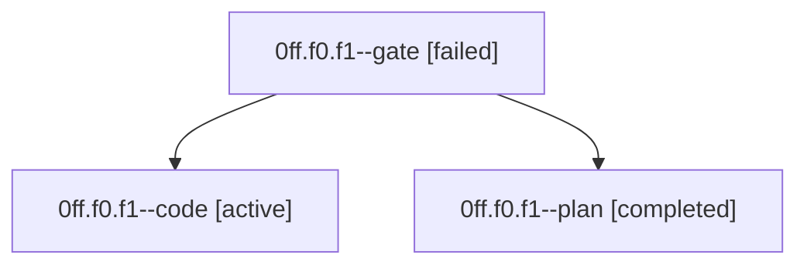

# Family: 0ff.f0.f1

[Agent Hoods](../README.md) / [bbugyi200](../users/bbugyi200/README.md) / [athena](../users/bbugyi200/machines/athena/README.md) / [0ff](../users/bbugyi200/machines/athena/hoods/0ff/README.md) / 0ff.f0.f1

Owner: `bbugyi200.athena` · Hood: `0ff` · Members: 3

## Lineage

The diagram is an optional enhancement; the ordered table below contains the same lineage in accessible text.

| Role | Agent | State | Model / provider | Timing | Commits | Prompt | Chat |
|---|---|---|---|---|---:|---|---|
| gate | 0ff.f0.f1--gate | failed | opus / claude | 2026-08-28T15:00:13.750698+00:00 → 2026-08-28T15:01:24.551326+00:00 | 0 | — | [Chat](../agents/bbugyi200.athena.0ff.f0.f1--gate/chat.md) |
| code | 0ff.f0.f1--code | active | grok-4.6 / grok | 2026-08-28T15:01:30.723777+00:00 | 0 | [Prompt](../agents/bbugyi200.athena.0ff.f0.f1--code/prompt.md) | — |
| plan | 0ff.f0.f1--plan | completed | opus / claude | 2026-08-28T14:44:12.742392+00:00 → 2026-08-28T15:00:21.540408+00:00 | 0 | [Prompt](../agents/bbugyi200.athena.0ff.f0.f1--plan/prompt.md) | [Chat](../agents/bbugyi200.athena.0ff.f0.f1--plan/chat.md) |

## Neighbors

| Agent | Relation | State |
|---|---|---|
| [0ff.f0](bbugyi200.athena.0ff.f0.md) (family · 3) | ancestor | completed 2, failed 1 |
| [0ff](bbugyi200.athena.0ff.md) (family · 3) | ancestor | completed 2, failed 1 |
| [0ff.f0.f0](../agents/bbugyi200.athena.0ff.f0.f0/README.md) | 0ff.f0 hood | waiting |
