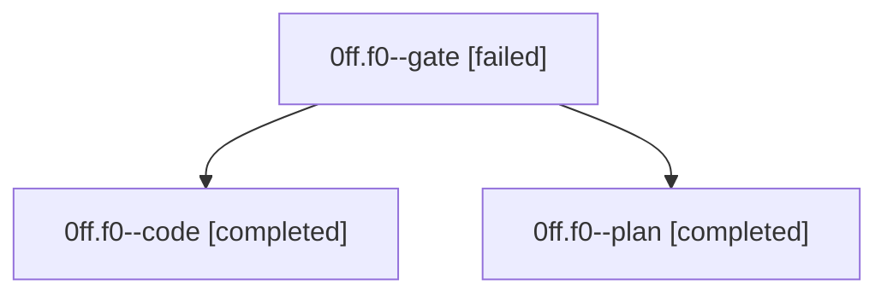

# Family: 0ff.f0

[Agent Hoods](../README.md) / [bbugyi200](../users/bbugyi200/README.md) / [athena](../users/bbugyi200/machines/athena/README.md) / [0ff](../users/bbugyi200/machines/athena/hoods/0ff/README.md) / 0ff.f0

Owner: `bbugyi200.athena` · Hood: `0ff` · Members: 3

## Lineage

The diagram is an optional enhancement; the ordered table below contains the same lineage in accessible text.

| Role | Agent | State | Model / provider | Timing | Commits | Prompt | Chat |
|---|---|---|---|---|---:|---|---|
| gate | 0ff.f0--gate | failed | gpt-5.6-sol / codex | 2026-08-28T13:41:40.968302+00:00 → 2026-08-28T13:44:25.228243+00:00 | 0 | — | [Chat](../agents/bbugyi200.athena.0ff.f0--gate/chat.md) |
| code | 0ff.f0--code | completed | grok-4.6 / grok | 2026-08-28T13:44:31.169814+00:00 → 2026-08-28T14:02:48.502605+00:00 | 0 | [Prompt](../agents/bbugyi200.athena.0ff.f0--code/prompt.md) | [Chat](../agents/bbugyi200.athena.0ff.f0--code/chat.md) |
| plan | 0ff.f0--plan | completed | gpt-5.6-sol / codex | 2026-08-28T13:34:13.093777+00:00 → 2026-08-28T13:41:48.147260+00:00 | 0 | [Prompt](../agents/bbugyi200.athena.0ff.f0--plan/prompt.md) | [Chat](../agents/bbugyi200.athena.0ff.f0--plan/chat.md) |

## Neighbors

| Agent | Relation | State |
|---|---|---|
| [0ff](bbugyi200.athena.0ff.md) (family · 3) | ancestor | completed 2, failed 1 |
| [0ff.f0.f0](../agents/bbugyi200.athena.0ff.f0.f0/README.md) | descendant | waiting |
| [0ff.f0.f1](bbugyi200.athena.0ff.f0.f1.md) (family · 3) | descendant | active 1, completed 1, failed 1 |
