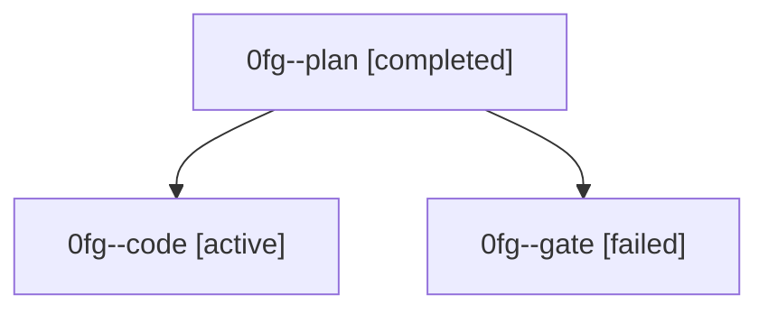

# Family: 0fg

[Agent Hoods](../README.md) / [bbugyi200](../users/bbugyi200/README.md) / [athena](../users/bbugyi200/machines/athena/README.md) / [0fg](../users/bbugyi200/machines/athena/hoods/0fg/README.md) / 0fg

Owner: `bbugyi200.athena` · Hood: `0fg` · Members: 3

## Lineage

The diagram is an optional enhancement; the ordered table below contains the same lineage in accessible text.

| Role | Agent | State | Model / provider | Timing | Commits | Prompt | Chat |
|---|---|---|---|---|---:|---|---|
| plan | 0fg--plan | completed | gpt-5.6-sol / codex | 2026-08-28T13:13:31.158450+00:00 → 2026-08-28T13:17:39.029907+00:00 | 0 | [Prompt](../agents/bbugyi200.athena.0fg--plan/prompt.md) | [Chat](../agents/bbugyi200.athena.0fg--plan/chat.md) |
| code | 0fg--code | active | gpt-5.5 / codex | 2026-08-28T13:18:50.977330+00:00 | [1](../agents/bbugyi200.athena.0fg--code/README.md#commits) | [Prompt](../agents/bbugyi200.athena.0fg--code/prompt.md) | — |
| gate | 0fg--gate | failed | gpt-5.6-sol / codex | 2026-08-28T13:17:31.984346+00:00 → 2026-08-28T13:18:44.377170+00:00 | 0 | — | [Chat](../agents/bbugyi200.athena.0fg--gate/chat.md) |

## Commits

| Role | Repo | Commit | Subject | Committed |
|---|---|---|---|---|
| code | bob-cli | [`9b534e3`](https://github.com/bobs-org/bob-cli/commit/9b534e38ef8db45881e3c545541419975aec4b58) | fix(capture): start scheduled captures blocked | 2026-08-28 09:24:54 EDT |
