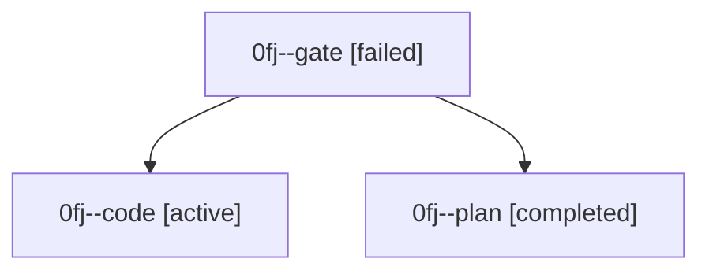

# Family: 0fj

[Agent Hoods](../README.md) / [bbugyi200](../users/bbugyi200/README.md) / [athena](../users/bbugyi200/machines/athena/README.md) / [0fj](../users/bbugyi200/machines/athena/hoods/0fj/README.md) / 0fj

Owner: `bbugyi200.athena` · Hood: `0fj` · Members: 3

## Lineage

The diagram is an optional enhancement; the ordered table below contains the same lineage in accessible text.

| Role | Agent | State | Model / provider | Timing | Commits | Prompt | Chat |
|---|---|---|---|---|---:|---|---|
| gate | 0fj--gate | failed | opus / claude | 2026-08-28T15:05:48.264872+00:00 → 2026-08-28T15:07:46.003160+00:00 | 0 | — | [Chat](../agents/bbugyi200.athena.0fj--gate/chat.md) |
| code | 0fj--code | active | grok-4.6 / grok | 2026-08-28T15:07:53.145931+00:00 | [1](../agents/bbugyi200.athena.0fj--code/README.md#commits) | [Prompt](../agents/bbugyi200.athena.0fj--code/prompt.md) | — |
| plan | 0fj--plan | completed | opus / claude | 2026-08-28T14:58:09.935712+00:00 → 2026-08-28T15:06:10.916110+00:00 | 0 | [Prompt](../agents/bbugyi200.athena.0fj--plan/prompt.md) | [Chat](../agents/bbugyi200.athena.0fj--plan/chat.md) |

## Commits

| Role | Repo | Commit | Subject | Committed |
|---|---|---|---|---|
| code | bob-cli | [`57a20e4`](https://github.com/bobs-org/bob-cli/commit/57a20e4ed3b771aba5414e8163dcec02e8bc9b12) | feat(highlights): put annotation tasks in an H2 Tasks section | 2026-08-28 11:22:44 EDT |
