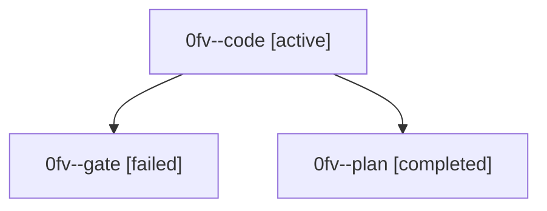

# Family: 0fv

[Agent Hoods](../README.md) / [bbugyi200](../users/bbugyi200/README.md) / [athena](../users/bbugyi200/machines/athena/README.md) / [0fv](../users/bbugyi200/machines/athena/hoods/0fv/README.md) / 0fv

Owner: `bbugyi200.athena` · Hood: `0fv` · Members: 3

## Lineage

The diagram is an optional enhancement; the ordered table below contains the same lineage in accessible text.

| Role | Agent | State | Model / provider | Timing | Commits | Prompt | Chat |
|---|---|---|---|---|---:|---|---|
| code | 0fv--code | active | grok-4.6 / grok | 2026-08-29T10:38:23.993170+00:00 | [1](../agents/bbugyi200.athena.0fv--code/README.md#commits) | [Prompt](../agents/bbugyi200.athena.0fv--code/prompt.md) | — |
| gate | 0fv--gate | failed | gpt-5.6-sol / codex | 2026-08-29T10:32:17.074268+00:00 → 2026-08-29T10:38:17.716219+00:00 | 0 | — | [Chat](../agents/bbugyi200.athena.0fv--gate/chat.md) |
| plan | 0fv--plan | completed | gpt-5.6-sol / codex | 2026-08-29T10:28:17.535083+00:00 → 2026-08-29T10:32:23.704040+00:00 | 0 | [Prompt](../agents/bbugyi200.athena.0fv--plan/prompt.md) | [Chat](../agents/bbugyi200.athena.0fv--plan/chat.md) |

## Commits

| Role | Repo | Commit | Subject | Committed |
|---|---|---|---|---|
| code | bob-cli | [`160d554`](https://github.com/bobs-org/bob-cli/commit/160d5544e1aa7079eee20d77186fb0bf2e2c8d41) | feat(highlights): add exact PDF output path to create | 2026-08-29 06:52:37 EDT |
