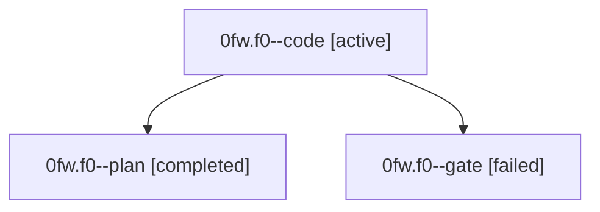

# Family: 0fw.f0

[Agent Hoods](../README.md) / [bbugyi200](../users/bbugyi200/README.md) / [athena](../users/bbugyi200/machines/athena/README.md) / [0fw](../users/bbugyi200/machines/athena/hoods/0fw/README.md) / 0fw.f0

Owner: `bbugyi200.athena` · Hood: `0fw` · Members: 3

## Lineage

The diagram is an optional enhancement; the ordered table below contains the same lineage in accessible text.

| Role | Agent | State | Model / provider | Timing | Commits | Prompt | Chat |
|---|---|---|---|---|---:|---|---|
| code | 0fw.f0--code | active | grok-4.6 / grok | 2026-08-29T11:30:34.981833+00:00 | [1](../agents/bbugyi200.athena.0fw.f0--code/README.md#commits) | [Prompt](../agents/bbugyi200.athena.0fw.f0--code/prompt.md) | — |
| plan | 0fw.f0--plan | completed | gpt-5.6-sol / codex | 2026-08-29T11:18:13.693575+00:00 → 2026-08-29T11:23:20.561154+00:00 | 0 | [Prompt](../agents/bbugyi200.athena.0fw.f0--plan/prompt.md) | [Chat](../agents/bbugyi200.athena.0fw.f0--plan/chat.md) |
| gate | 0fw.f0--gate | failed | gpt-5.6-sol / codex | 2026-08-29T11:23:13.584630+00:00 → 2026-08-29T11:30:28.543781+00:00 | 0 | — | [Chat](../agents/bbugyi200.athena.0fw.f0--gate/chat.md) |

## Commits

| Role | Repo | Commit | Subject | Committed |
|---|---|---|---|---|
| code | bob-cli | [`2fd247d`](https://github.com/bobs-org/bob-cli/commit/2fd247d4fdb1d02336254b0603259b0f5ec70770) | feat(capture-complete): offer a create-future-Pomodoro completion action | 2026-08-29 07:49:54 EDT |

## Neighbors

| Agent | Relation | State |
|---|---|---|
| [0fw](bbugyi200.athena.0fw.md) (family · 3) | ancestor | completed 2, failed 1 |
