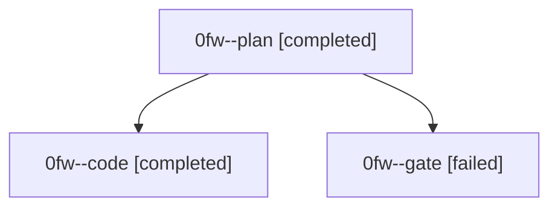

# Family: 0fw

[Agent Hoods](../README.md) / [bbugyi200](../users/bbugyi200/README.md) / [athena](../users/bbugyi200/machines/athena/README.md) / [0fw](../users/bbugyi200/machines/athena/hoods/0fw/README.md) / 0fw

Owner: `bbugyi200.athena` · Hood: `0fw` · Members: 3

## Lineage

The diagram is an optional enhancement; the ordered table below contains the same lineage in accessible text.

| Role | Agent | State | Model / provider | Timing | Commits | Prompt | Chat |
|---|---|---|---|---|---:|---|---|
| plan | 0fw--plan | completed | gpt-5.6-sol / codex | 2026-08-29T10:50:24.457330+00:00 → 2026-08-29T10:56:54.017034+00:00 | 0 | [Prompt](../agents/bbugyi200.athena.0fw--plan/prompt.md) | [Chat](../agents/bbugyi200.athena.0fw--plan/chat.md) |
| code | 0fw--code | completed | gpt-5.5 / codex | 2026-08-29T10:57:46.713978+00:00 → 2026-08-29T11:11:24.937492+00:00 | [1](../agents/bbugyi200.athena.0fw--code/README.md#commits) | [Prompt](../agents/bbugyi200.athena.0fw--code/prompt.md) | [Chat](../agents/bbugyi200.athena.0fw--code/chat.md) |
| gate | 0fw--gate | failed | gpt-5.6-sol / codex | 2026-08-29T10:56:47.048476+00:00 → 2026-08-29T10:57:40.302277+00:00 | 0 | — | [Chat](../agents/bbugyi200.athena.0fw--gate/chat.md) |

## Commits

| Role | Repo | Commit | Subject | Committed |
|---|---|---|---|---|
| code | bob-cli | [`5e2f5ea`](https://github.com/bobs-org/bob-cli/commit/5e2f5eae92dd8910e8ba4556d13ad6bdc05c4fb6) | feat(capture): create named future pomodoros | 2026-08-29 07:10:59 EDT |

## Neighbors

| Agent | Relation | State |
|---|---|---|
| [0fw.f0](bbugyi200.athena.0fw.f0.md) (family · 3) | descendant | active 1, completed 1, failed 1 |
