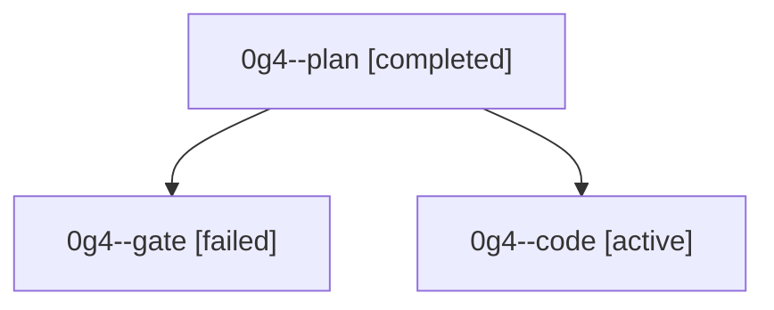

# Family: 0g4

[Agent Hoods](../README.md) / [bbugyi200](../users/bbugyi200/README.md) / [athena](../users/bbugyi200/machines/athena/README.md) / [0g4](../users/bbugyi200/machines/athena/hoods/0g4/README.md) / 0g4

Owner: `bbugyi200.athena` · Hood: `0g4` · Members: 3

## Lineage

The diagram is an optional enhancement; the ordered table below contains the same lineage in accessible text.

| Role | Agent | State | Model / provider | Timing | Commits | Prompt | Chat |
|---|---|---|---|---|---:|---|---|
| plan | 0g4--plan | completed | opus / claude | 2026-08-29T13:52:59.363749+00:00 → 2026-08-29T14:01:26.847037+00:00 | 0 | [Prompt](../agents/bbugyi200.athena.0g4--plan/prompt.md) | [Chat](../agents/bbugyi200.athena.0g4--plan/chat.md) |
| gate | 0g4--gate | failed | opus / claude | 2026-08-29T14:01:19.700813+00:00 → 2026-08-29T14:02:47.857425+00:00 | 0 | — | [Chat](../agents/bbugyi200.athena.0g4--gate/chat.md) |
| code | 0g4--code | active | grok-4.6 / grok | 2026-08-29T14:02:53.803718+00:00 | [1](../agents/bbugyi200.athena.0g4--code/README.md#commits) | [Prompt](../agents/bbugyi200.athena.0g4--code/prompt.md) | — |

## Commits

| Role | Repo | Commit | Subject | Committed |
|---|---|---|---|---|
| code | bob-cli | [`76c259e`](https://github.com/bobs-org/bob-cli/commit/76c259e06835d91e6121aeeb86655c539db68fb5) | docs(projects): document managed work logs moving onto ^prj | 2026-08-29 10:14:26 EDT |
