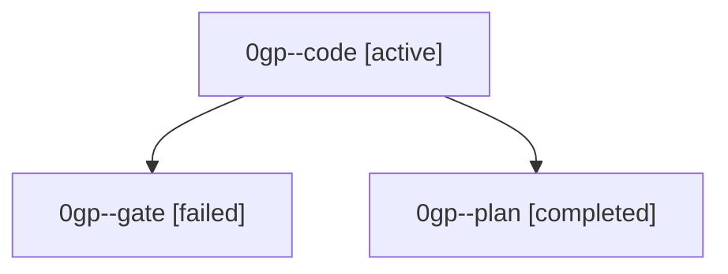

# Family: 0gp

[Agent Hoods](../README.md) / [bbugyi200](../users/bbugyi200/README.md) / [athena](../users/bbugyi200/machines/athena/README.md) / [0gp](../users/bbugyi200/machines/athena/hoods/0gp/README.md) / 0gp

Owner: `bbugyi200.athena` · Hood: `0gp` · Members: 3

## Lineage

The diagram is an optional enhancement; the ordered table below contains the same lineage in accessible text.

| Role | Agent | State | Model / provider | Timing | Commits | Prompt | Chat |
|---|---|---|---|---|---:|---|---|
| code | 0gp--code | active | gpt-5.5 / codex | 2026-09-06T16:52:38.690819+00:00 | 0 | [Prompt](../agents/bbugyi200.athena.0gp--code/prompt.md) | — |
| gate | 0gp--gate | failed | gpt-6-astra / codex | 2026-09-06T16:51:34.312295+00:00 → 2026-09-06T16:52:31.165802+00:00 | 0 | — | [Chat](../agents/bbugyi200.athena.0gp--gate/chat.md) |
| plan | 0gp--plan | completed | gpt-6-astra / codex | 2026-09-06T16:47:27.459973+00:00 → 2026-09-06T16:51:47.203843+00:00 | 0 | [Prompt](../agents/bbugyi200.athena.0gp--plan/prompt.md) | [Chat](../agents/bbugyi200.athena.0gp--plan/chat.md) |
