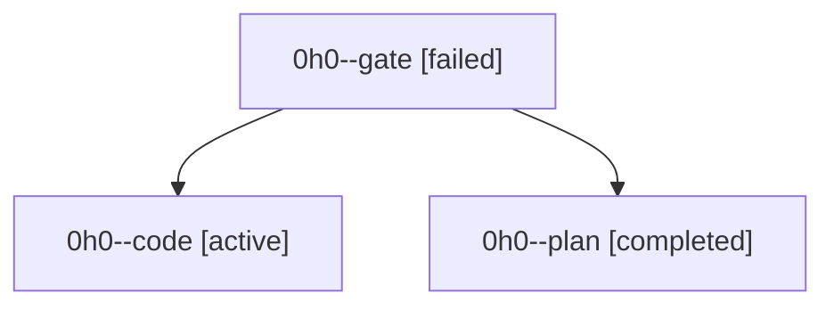

# Family: 0h0

[Agent Hoods](../README.md) / [bbugyi200](../users/bbugyi200/README.md) / [athena](../users/bbugyi200/machines/athena/README.md) / [0h0](../users/bbugyi200/machines/athena/hoods/0h0/README.md) / 0h0

Owner: `bbugyi200.athena` · Hood: `0h0` · Members: 3

## Lineage

The diagram is an optional enhancement; the ordered table below contains the same lineage in accessible text.

| Role | Agent | State | Model / provider | Timing | Commits | Prompt | Chat |
|---|---|---|---|---|---:|---|---|
| gate | 0h0--gate | failed | gpt-6-astra / codex | 2026-09-06T20:29:57.437095+00:00 → 2026-09-06T20:31:24.536720+00:00 | 0 | — | [Chat](../agents/bbugyi200.athena.0h0--gate/chat.md) |
| code | 0h0--code | active | gpt-5.5 / codex | 2026-09-06T20:31:32.800483+00:00 | 0 | [Prompt](../agents/bbugyi200.athena.0h0--code/prompt.md) | — |
| plan | 0h0--plan | completed | gpt-6-astra / codex | 2026-09-06T20:24:51.628537+00:00 → 2026-09-06T20:30:15.914171+00:00 | 0 | [Prompt](../agents/bbugyi200.athena.0h0--plan/prompt.md) | [Chat](../agents/bbugyi200.athena.0h0--plan/chat.md) |
