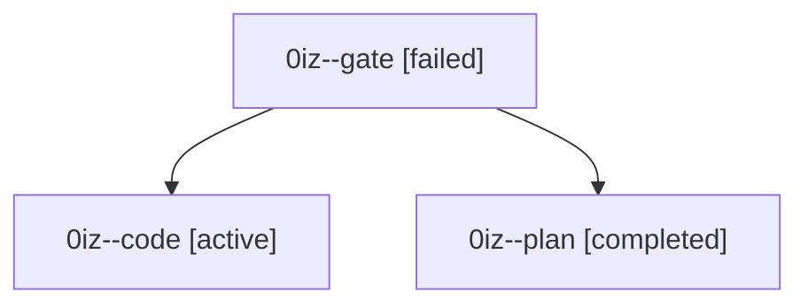

# Family: 0iz

[Agent Hoods](../README.md) / [bbugyi200](../users/bbugyi200/README.md) / [athena](../users/bbugyi200/machines/athena/README.md) / [0iz](../users/bbugyi200/machines/athena/hoods/0iz/README.md) / 0iz

Owner: `bbugyi200.athena` · Hood: `0iz` · Members: 3

## Lineage

The diagram is an optional enhancement; the ordered table below contains the same lineage in accessible text.

| Role | Agent | State | Model / provider | Timing | Commits | Prompt | Chat |
|---|---|---|---|---|---:|---|---|
| gate | 0iz--gate | failed | gpt-6-astra / codex | 2026-09-10T19:48:30.906831+00:00 → 2026-09-10T19:50:23.234617+00:00 | 0 | — | [Chat](../agents/bbugyi200.athena.0iz--gate/chat.md) |
| code | 0iz--code | active | gpt-5.5 / codex | 2026-09-10T19:51:33.796678+00:00 | 0 | [Prompt](../agents/bbugyi200.athena.0iz--code/prompt.md) | — |
| plan | 0iz--plan | completed | gpt-6-astra / codex | 2026-09-10T19:43:22.323374+00:00 → 2026-09-10T19:48:06.442650+00:00 | 0 | [Prompt](../agents/bbugyi200.athena.0iz--plan/prompt.md) | [Chat](../agents/bbugyi200.athena.0iz--plan/chat.md) |
