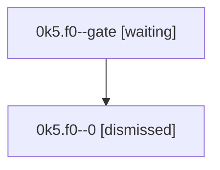

# Family: 0k5.f0

[Agent Hoods](../README.md) / [bbugyi200](../users/bbugyi200/README.md) / [athena](../users/bbugyi200/machines/athena/README.md) / [0k5](../users/bbugyi200/machines/athena/hoods/0k5/README.md) / 0k5.f0

Owner: `bbugyi200.athena` · Hood: `0k5` · Members: 2

## Lineage

The diagram is an optional enhancement; the ordered table below contains the same lineage in accessible text.

| Role | Agent | State | Model / provider | Timing | Commits | Prompt | Chat |
|---|---|---|---|---|---:|---|---|
| gate | 0k5.f0--gate | waiting | gpt-5.6-sol / codex | 2026-09-12T17:19:36.968814+00:00 | 0 | — | — |
| 0 | 0k5.f0--0 | dismissed | gpt-5.6-sol / codex | 2026-09-12T13:14:42.784150 → 2026-09-12T13:19:38.540170 | 0 | [Prompt](../agents/bbugyi200.athena.0k5.f0--0/prompt.md) | [Chat](../agents/bbugyi200.athena.0k5.f0--0/chat.md) |

## Neighbors

| Agent | Relation | State |
|---|---|---|
| [0k5](bbugyi200.athena.0k5.md) (family · 3) | ancestor | completed 2, failed 1 |
| [0k5.f1](bbugyi200.athena.0k5.f1.md) (family · 3) | 0k5 hood | active 1, completed 1, failed 1 |
