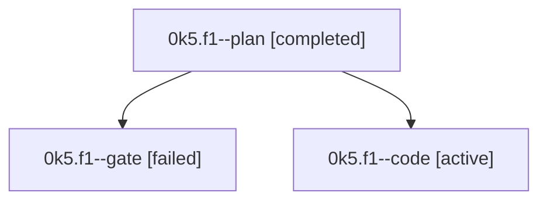

# Family: 0k5.f1

[Agent Hoods](../README.md) / [bbugyi200](../users/bbugyi200/README.md) / [athena](../users/bbugyi200/machines/athena/README.md) / [0k5](../users/bbugyi200/machines/athena/hoods/0k5/README.md) / 0k5.f1

Owner: `bbugyi200.athena` · Hood: `0k5` · Members: 3

## Lineage

The diagram is an optional enhancement; the ordered table below contains the same lineage in accessible text.

| Role | Agent | State | Model / provider | Timing | Commits | Prompt | Chat |
|---|---|---|---|---|---:|---|---|
| plan | 0k5.f1--plan | completed | gpt-5.6-sol / codex | 2026-09-12T19:44:19.483453+00:00 → 2026-09-12T19:50:58.771401+00:00 | 0 | [Prompt](../agents/bbugyi200.athena.0k5.f1--plan/prompt.md) | [Chat](../agents/bbugyi200.athena.0k5.f1--plan/chat.md) |
| gate | 0k5.f1--gate | failed | gpt-5.6-sol / codex | 2026-09-12T19:52:02.258560+00:00 → 2026-09-12T20:52:30.938017+00:00 | 0 | — | [Chat](../agents/bbugyi200.athena.0k5.f1--gate/chat.md) |
| code | 0k5.f1--code | active | gpt-5.5 / codex | 2026-09-12T20:52:37.507820+00:00 | 0 | [Prompt](../agents/bbugyi200.athena.0k5.f1--code/prompt.md) | — |

## Neighbors

| Agent | Relation | State |
|---|---|---|
| [0k5](bbugyi200.athena.0k5.md) (family · 3) | ancestor | completed 2, failed 1 |
| [0k5.f0](bbugyi200.athena.0k5.f0.md) (family · 2) | 0k5 hood | dismissed 1, waiting 1 |
