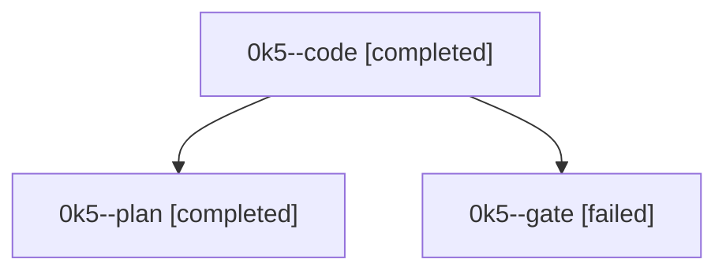

# Family: 0k5

[Agent Hoods](../README.md) / [bbugyi200](../users/bbugyi200/README.md) / [athena](../users/bbugyi200/machines/athena/README.md) / [0k5](../users/bbugyi200/machines/athena/hoods/0k5/README.md) / 0k5

Owner: `bbugyi200.athena` · Hood: `0k5` · Members: 3

## Lineage

The diagram is an optional enhancement; the ordered table below contains the same lineage in accessible text.

| Role | Agent | State | Model / provider | Timing | Commits | Prompt | Chat |
|---|---|---|---|---|---:|---|---|
| code | 0k5--code | completed | gpt-5.5 / codex | 2026-09-12T12:49:28.148850+00:00 → 2026-09-12T13:02:06.139520+00:00 | 0 | [Prompt](../agents/bbugyi200.athena.0k5--code/prompt.md) | [Chat](../agents/bbugyi200.athena.0k5--code/chat.md) |
| plan | 0k5--plan | completed | gpt-6-astra / codex | 2026-09-12T12:42:27.060792+00:00 → 2026-09-12T12:48:09.103829+00:00 | 0 | [Prompt](../agents/bbugyi200.athena.0k5--plan/prompt.md) | [Chat](../agents/bbugyi200.athena.0k5--plan/chat.md) |
| gate | 0k5--gate | failed | gpt-6-astra / codex | 2026-09-12T12:48:24.629217+00:00 → 2026-09-12T12:49:11.093288+00:00 | 0 | — | [Chat](../agents/bbugyi200.athena.0k5--gate/chat.md) |

## Neighbors

| Agent | Relation | State |
|---|---|---|
| [0k5.f0](bbugyi200.athena.0k5.f0.md) (family · 2) | descendant | dismissed 1, waiting 1 |
| [0k5.f1](bbugyi200.athena.0k5.f1.md) (family · 3) | descendant | active 1, completed 1, failed 1 |
