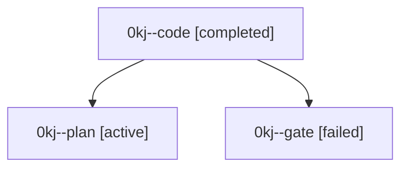

# Family: 0kj

[Agent Hoods](../README.md) / [bbugyi200](../users/bbugyi200/README.md) / [athena](../users/bbugyi200/machines/athena/README.md) / [0kj](../users/bbugyi200/machines/athena/hoods/0kj/README.md) / 0kj

Owner: `bbugyi200.athena` · Hood: `0kj` · Members: 3

## Lineage

The diagram is an optional enhancement; the ordered table below contains the same lineage in accessible text.

| Role | Agent | State | Model / provider | Timing | Commits | Prompt | Chat |
|---|---|---|---|---|---:|---|---|
| code | 0kj--code | completed | sonnet / claude | 2026-09-14T13:53:34.856638+00:00 → 2026-09-14T14:26:32.166189+00:00 | [1](../agents/bbugyi200.athena.0kj--code/README.md#commits) | [Prompt](../agents/bbugyi200.athena.0kj--code/prompt.md) | [Chat](../agents/bbugyi200.athena.0kj--code/chat.md) |
| plan | 0kj--plan | active | gpt-6-astra / codex | 2026-09-14T13:44:50.877322+00:00 | 0 | [Prompt](../agents/bbugyi200.athena.0kj--plan/prompt.md) | [Chat](../agents/bbugyi200.athena.0kj--plan/chat.md) |
| gate | 0kj--gate | failed | gpt-6-astra / codex | 2026-09-14T13:52:04.993735+00:00 → 2026-09-14T13:53:10.406234+00:00 | 0 | — | [Chat](../agents/bbugyi200.athena.0kj--gate/chat.md) |

## Commits

| Role | Repo | Commit | Subject | Committed |
|---|---|---|---|---|
| code | bob-cli | [`6892ec0`](https://github.com/bobs-org/bob-cli/commit/6892ec089b3635395260b39bde9b5a4265f200cc) | feat(task-status-hooks): retry transient sync failures with jittered backoff | 2026-09-14 10:25:42 EDT |
