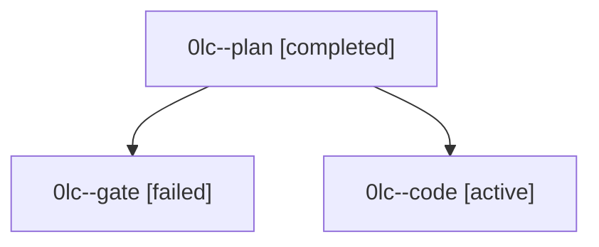

# Family: 0lc

[Agent Hoods](../README.md) / [bbugyi200](../users/bbugyi200/README.md) / [athena](../users/bbugyi200/machines/athena/README.md) / [0lc](../users/bbugyi200/machines/athena/hoods/0lc/README.md) / 0lc

Owner: `bbugyi200.athena` · Hood: `0lc` · Members: 3

## Lineage

The diagram is an optional enhancement; the ordered table below contains the same lineage in accessible text.

| Role | Agent | State | Model / provider | Timing | Commits | Prompt | Chat |
|---|---|---|---|---|---:|---|---|
| plan | 0lc--plan | completed | gpt-5.6-sol / codex | 2026-09-15T16:17:53.450940+00:00 → 2026-09-15T16:22:58.653208+00:00 | 0 | [Prompt](../agents/bbugyi200.athena.0lc--plan/prompt.md) | [Chat](../agents/bbugyi200.athena.0lc--plan/chat.md) |
| gate | 0lc--gate | failed | gpt-5.6-sol / codex | 2026-09-15T16:22:39.592417+00:00 → 2026-09-15T16:23:36.193987+00:00 | 0 | — | [Chat](../agents/bbugyi200.athena.0lc--gate/chat.md) |
| code | 0lc--code | active | gpt-5.5 / codex | 2026-09-15T16:33:46.935661+00:00 | [1](../agents/bbugyi200.athena.0lc--code/README.md#commits) | [Prompt](../agents/bbugyi200.athena.0lc--code/prompt.md) | — |

## Commits

| Role | Repo | Commit | Subject | Committed |
|---|---|---|---|---|
| code | bob-cli | [`95629db`](https://github.com/bobs-org/bob-cli/commit/95629dbd8e697b677049424c4ef53d95038de93d) | fix(task-status-hooks): route human retry logs to stdout | 2026-09-15 12:41:26 EDT |
