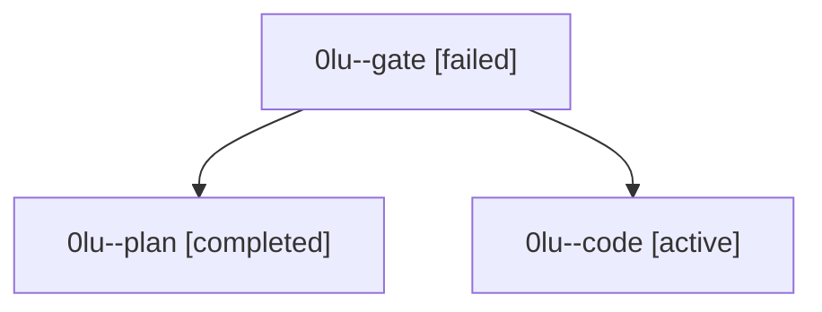

# Family: 0lu

[Agent Hoods](../README.md) / [bbugyi200](../users/bbugyi200/README.md) / [athena](../users/bbugyi200/machines/athena/README.md) / [0lu](../users/bbugyi200/machines/athena/hoods/0lu/README.md) / 0lu

Owner: `bbugyi200.athena` · Hood: `0lu` · Members: 3

## Lineage

The diagram is an optional enhancement; the ordered table below contains the same lineage in accessible text.

| Role | Agent | State | Model / provider | Timing | Commits | Prompt | Chat |
|---|---|---|---|---|---:|---|---|
| gate | 0lu--gate | failed | opus / claude | 2026-09-16T13:03:22.607535+00:00 → 2026-09-16T13:03:49.878684+00:00 | 0 | — | [Chat](../agents/bbugyi200.athena.0lu--gate/chat.md) |
| plan | 0lu--plan | completed | opus / claude | 2026-09-16T12:59:13.465745+00:00 → 2026-09-16T13:02:44.933994+00:00 | 0 | [Prompt](../agents/bbugyi200.athena.0lu--plan/prompt.md) | [Chat](../agents/bbugyi200.athena.0lu--plan/chat.md) |
| code | 0lu--code | active | sonnet / claude | 2026-09-16T13:04:16.494710+00:00 | 0 | [Prompt](../agents/bbugyi200.athena.0lu--code/prompt.md) | — |
