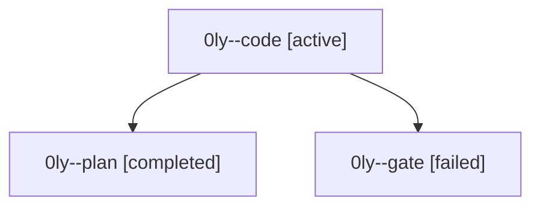

# Family: 0ly

[Agent Hoods](../README.md) / [bbugyi200](../users/bbugyi200/README.md) / [athena](../users/bbugyi200/machines/athena/README.md) / [0ly](../users/bbugyi200/machines/athena/hoods/0ly/README.md) / 0ly

Owner: `bbugyi200.athena` · Hood: `0ly` · Members: 3

## Lineage

The diagram is an optional enhancement; the ordered table below contains the same lineage in accessible text.

| Role | Agent | State | Model / provider | Timing | Commits | Prompt | Chat |
|---|---|---|---|---|---:|---|---|
| code | 0ly--code | active | sonnet / claude | 2026-09-16T14:15:05.180010+00:00 | 0 | [Prompt](../agents/bbugyi200.athena.0ly--code/prompt.md) | — |
| plan | 0ly--plan | completed | opus / claude | 2026-09-16T14:05:40.840958+00:00 → 2026-09-16T14:11:44.134805+00:00 | 0 | [Prompt](../agents/bbugyi200.athena.0ly--plan/prompt.md) | [Chat](../agents/bbugyi200.athena.0ly--plan/chat.md) |
| gate | 0ly--gate | failed | opus / claude | 2026-09-16T14:13:57.039756+00:00 → 2026-09-16T14:14:33.397865+00:00 | 0 | — | [Chat](../agents/bbugyi200.athena.0ly--gate/chat.md) |
