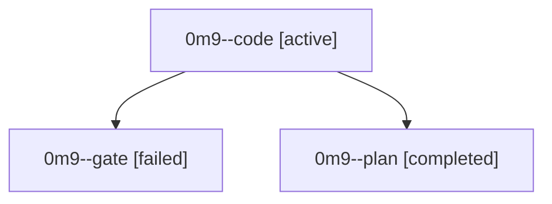

# Family: 0m9

[Agent Hoods](../README.md) / [bbugyi200](../users/bbugyi200/README.md) / [athena](../users/bbugyi200/machines/athena/README.md) / [0m9](../users/bbugyi200/machines/athena/hoods/0m9/README.md) / 0m9

Owner: `bbugyi200.athena` · Hood: `0m9` · Members: 3

## Lineage

The diagram is an optional enhancement; the ordered table below contains the same lineage in accessible text.

| Role | Agent | State | Model / provider | Timing | Commits | Prompt | Chat |
|---|---|---|---|---|---:|---|---|
| code | 0m9--code | active | gpt-5.5 / codex | 2026-09-17T13:58:41.452118+00:00 | [1](../agents/bbugyi200.athena.0m9--code/README.md#commits) | [Prompt](../agents/bbugyi200.athena.0m9--code/prompt.md) | — |
| gate | 0m9--gate | failed | gpt-5.6-sol / codex | 2026-09-17T13:02:07.822988+00:00 → 2026-09-17T13:04:32.948560+00:00 | 0 | — | [Chat](../agents/bbugyi200.athena.0m9--gate/chat.md) |
| plan | 0m9--plan | completed | gpt-5.6-sol / codex | 2026-09-17T12:54:02.136901+00:00 → 2026-09-17T13:02:28.424081+00:00 | 0 | [Prompt](../agents/bbugyi200.athena.0m9--plan/prompt.md) | [Chat](../agents/bbugyi200.athena.0m9--plan/chat.md) |

## Commits

| Role | Repo | Commit | Subject | Committed |
|---|---|---|---|---|
| code | bob-cli | [`d2fe3a3`](https://github.com/bobs-org/bob-cli/commit/d2fe3a3a24c9a56e162646dc0c11f87c39c2a280) | feat(task-status): prune empty pomodoros | 2026-09-17 10:20:01 EDT |
