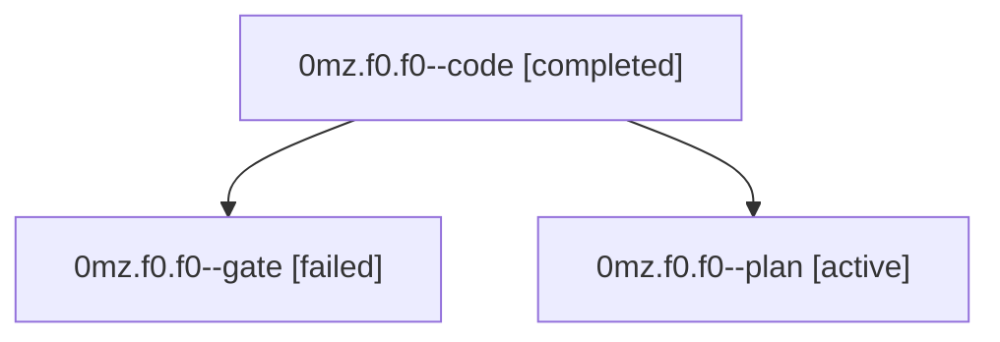

# Family: 0mz.f0.f0

[Agent Hoods](../README.md) / [bbugyi200](../users/bbugyi200/README.md) / [athena](../users/bbugyi200/machines/athena/README.md) / [0mz](../users/bbugyi200/machines/athena/hoods/0mz/README.md) / 0mz.f0.f0

Owner: `bbugyi200.athena` · Hood: `0mz` · Members: 3

## Lineage

The diagram is an optional enhancement; the ordered table below contains the same lineage in accessible text.

| Role | Agent | State | Model / provider | Timing | Commits | Prompt | Chat |
|---|---|---|---|---|---:|---|---|
| code | 0mz.f0.f0--code | completed | gpt-5.5 / codex | 2026-09-18T17:18:21.332002+00:00 → 2026-09-18T17:36:34.850191+00:00 | [1](../agents/bbugyi200.athena.0mz.f0.f0--code/README.md#commits) | [Prompt](../agents/bbugyi200.athena.0mz.f0.f0--code/prompt.md) | [Chat](../agents/bbugyi200.athena.0mz.f0.f0--code/chat.md) |
| gate | 0mz.f0.f0--gate | failed | gpt-5.6-sol / codex | 2026-09-18T17:16:59.644805+00:00 → 2026-09-18T17:17:40.260385+00:00 | 0 | — | [Chat](../agents/bbugyi200.athena.0mz.f0.f0--gate/chat.md) |
| plan | 0mz.f0.f0--plan | active | gpt-5.6-sol / codex | 2026-09-18T17:09:52.609822+00:00 | 0 | [Prompt](../agents/bbugyi200.athena.0mz.f0.f0--plan/prompt.md) | [Chat](../agents/bbugyi200.athena.0mz.f0.f0--plan/chat.md) |

## Commits

| Role | Repo | Commit | Subject | Committed |
|---|---|---|---|---|
| code | bob-cli | [`9aaeb9e`](https://github.com/bobs-org/bob-cli/commit/9aaeb9ec053c46366b9bb8e235085af3fbee6abd) | feat(capture): make ensure-next task toggle default | 2026-09-18 13:35:29 EDT |

## Neighbors

| Agent | Relation | State |
|---|---|---|
| [0mz.f0](bbugyi200.athena.0mz.f0.md) (family · 3) | ancestor | active 1, completed 1, failed 1 |
| [0mz](bbugyi200.athena.0mz.md) (family · 3) | ancestor | active 1, completed 1, failed 1 |
| [0mz.f0.f0.f0](bbugyi200.athena.0mz.f0.f0.f0.md) (family · 3) | descendant | active 1, completed 1, failed 1 |
