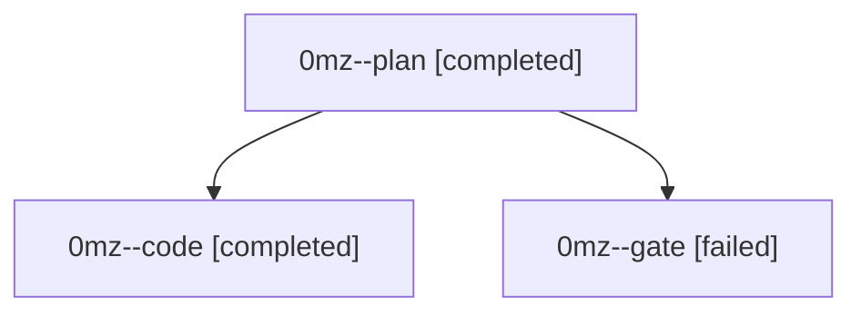

# Family: 0mz

[Agent Hoods](../README.md) / [bbugyi200](../users/bbugyi200/README.md) / [athena](../users/bbugyi200/machines/athena/README.md) / [0mz](../users/bbugyi200/machines/athena/hoods/0mz/README.md) / 0mz

Owner: `bbugyi200.athena` · Hood: `0mz` · Members: 3

## Lineage

The diagram is an optional enhancement; the ordered table below contains the same lineage in accessible text.

| Role | Agent | State | Model / provider | Timing | Commits | Prompt | Chat |
|---|---|---|---|---|---:|---|---|
| plan | 0mz--plan | completed | gpt-5.6-sol / codex | 2026-09-18T15:12:47.968220+00:00 → 2026-09-18T15:20:57.905694+00:00 | 0 | [Prompt](../agents/bbugyi200.athena.0mz--plan/prompt.md) | [Chat](../agents/bbugyi200.athena.0mz--plan/chat.md) |
| code | 0mz--code | completed | gpt-5.5 / codex | 2026-09-18T15:22:25.606134+00:00 → 2026-09-18T15:29:51.320386+00:00 | 0 | [Prompt](../agents/bbugyi200.athena.0mz--code/prompt.md) | [Chat](../agents/bbugyi200.athena.0mz--code/chat.md) |
| gate | 0mz--gate | failed | gpt-5.6-sol / codex | 2026-09-18T15:21:18.082734+00:00 → 2026-09-18T15:21:58.240423+00:00 | 0 | — | [Chat](../agents/bbugyi200.athena.0mz--gate/chat.md) |

## Neighbors

| Agent | Relation | State |
|---|---|---|
| [0mz.f0](bbugyi200.athena.0mz.f0.md) (family · 3) | descendant | active 1, completed 1, failed 1 |
