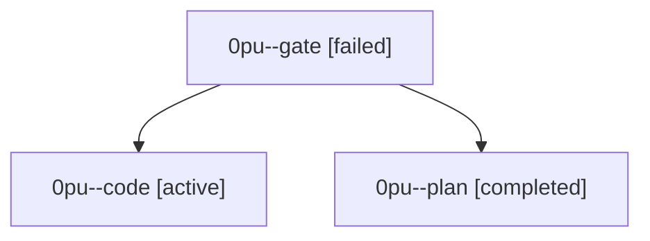

# Family: 0pu

[Agent Hoods](../README.md) / [bbugyi200](../users/bbugyi200/README.md) / [athena](../users/bbugyi200/machines/athena/README.md) / [0pu](../users/bbugyi200/machines/athena/hoods/0pu/README.md) / 0pu

Owner: `bbugyi200.athena` · Hood: `0pu` · Members: 3

## Lineage

The diagram is an optional enhancement; the ordered table below contains the same lineage in accessible text.

| Role | Agent | State | Model / provider | Timing | Commits | Prompt | Chat |
|---|---|---|---|---|---:|---|---|
| gate | 0pu--gate | failed | opus / claude | 2026-09-23T13:41:21.530487+00:00 → 2026-09-23T13:42:08.421887+00:00 | 0 | — | [Chat](../agents/bbugyi200.athena.0pu--gate/chat.md) |
| code | 0pu--code | active | muse-spark-1.3-contributor / muse | 2026-09-23T13:42:41.680265+00:00 | 0 | [Prompt](../agents/bbugyi200.athena.0pu--code/prompt.md) | — |
| plan | 0pu--plan | completed | opus / claude | 2026-09-23T13:33:35.998611+00:00 → 2026-09-23T13:38:51.949656+00:00 | 0 | [Prompt](../agents/bbugyi200.athena.0pu--plan/prompt.md) | [Chat](../agents/bbugyi200.athena.0pu--plan/chat.md) |
