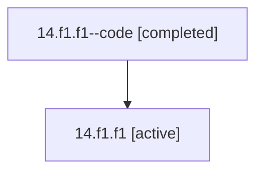

# Family: 14.f1.f1

[Agent Hoods](../README.md) / [bbugyi200](../users/bbugyi200/README.md) / [athena](../users/bbugyi200/machines/athena/README.md) / [14](../users/bbugyi200/machines/athena/hoods/14/README.md) / 14.f1.f1

Owner: `bbugyi200.athena` · Hood: `14` · Members: 2

## Lineage

The diagram is an optional enhancement; the ordered table below contains the same lineage in accessible text.

| Role | Agent | State | Model / provider | Timing | Commits | Prompt | Chat |
|---|---|---|---|---|---:|---|---|
| code | 14.f1.f1--code | completed | gpt-5.5 / codex | 2026-07-07T22:19:25.808102+00:00 | 0 | — | [Chat](../agents/bbugyi200.athena.14.f1.f1--code/chat.md) |
| root | 14.f1.f1 | active | gpt-5.5 / codex | 2026-07-07T22:15:55.093351+00:00 | [1](../agents/bbugyi200.athena.14.f1.f1/README.md#commits) | [Prompt](../agents/bbugyi200.athena.14.f1.f1/prompt.md) | [Chat](../agents/bbugyi200.athena.14.f1.f1/chat.md) |

## Commits

| Role | Repo | Commit | Subject | Committed |
|---|---|---|---|---|
| root | bob-cli | [`7caa0fb`](https://github.com/bobs-org/bob-cli/commit/7caa0fb0a0e8dfd11d318951fe64f7ab18fb00db) | chore: Add SDD prompt and plan for non\_recursive\_non\_transcluded\_pomodoro\_links | 2026-07-07 22:19:23 UTC |
| — | bob-cli | [`170cd89`](https://github.com/bobs-org/bob-cli/commit/170cd89dbb18d29463ab2a1d77aacfd2a1c7c128) | chore: Mark SDD plan done | 2026-07-07 22:27:06 UTC |

## Neighbors

| Agent | Relation | State |
|---|---|---|
| [14.f1](bbugyi200.athena.14.f1.md) (family · 2) | ancestor | active 1, completed 1 |
| [14](bbugyi200.athena.14.md) (family · 2) | ancestor | active 1, completed 1 |
