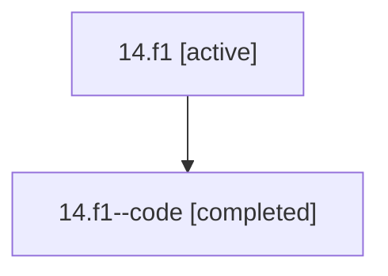

# Family: 14.f1

Owner: `bbugyi200.athena` · Hood: `14` · Members: 2

## Lineage

The diagram is an optional enhancement; the ordered table below contains the same lineage in accessible text.

| Role | Agent | State | Model / provider | Timing | Commits | Prompt | Chat |
|---|---|---|---|---|---:|---|---|
| root | 14.f1 | active | gpt-5.5 / codex | 2026-07-07T21:15:39.216703+00:00 | 0 | [Prompt](../agents/bbugyi200.athena.14.f1/prompt.md) | [Chat](../agents/bbugyi200.athena.14.f1/chat.md) |
| code | 14.f1--code | completed | gpt-5.5 / codex | 2026-07-07T21:20:39.711899+00:00 | 0 | — | [Chat](../agents/bbugyi200.athena.14.f1--code/chat.md) |
