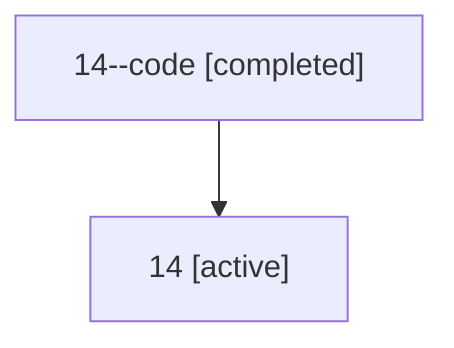

# Family: 14

[Agent Hoods](../README.md) / [bbugyi200](../users/bbugyi200/README.md) / [athena](../users/bbugyi200/machines/athena/README.md) / [14](../users/bbugyi200/machines/athena/hoods/14/README.md) / 14

Owner: `bbugyi200.athena` · Hood: `14` · Members: 2

## Lineage

The diagram is an optional enhancement; the ordered table below contains the same lineage in accessible text.

| Role | Agent | State | Model / provider | Timing | Commits | Prompt | Chat |
|---|---|---|---|---|---:|---|---|
| code | 14--code | completed | gpt-5.5 / codex | 2026-07-07T21:09:14.698557+00:00 | 0 | — | [Chat](../agents/bbugyi200.athena.14--code/chat.md) |
| root | 14 | active | gpt-5.5 / codex | 2026-07-07T21:04:46.528619+00:00 | [1](../agents/bbugyi200.athena.14/README.md#commits) | [Prompt](../agents/bbugyi200.athena.14/prompt.md) | [Chat](../agents/bbugyi200.athena.14/chat.md) |

## Commits

| Role | Repo | Commit | Subject | Committed |
|---|---|---|---|---|
| root | bob-cli | [`3b818dc`](https://github.com/bobs-org/bob-cli/commit/3b818dca2138c87781b900260376e2501f30b97d) | chore: Add SDD prompt and plan for in\_progress\_transcluded\_pomodoro\_tasks | 2026-07-07 17:09:13 EDT |
| — | bob-cli | [`d2018d1`](https://github.com/bobs-org/bob-cli/commit/d2018d12af6d52e26d6b70d00030ec5369692735) | chore: Mark SDD plan done | 2026-07-07 17:20:41 EDT |

## Neighbors

| Agent | Relation | State |
|---|---|---|
| [14.f1](bbugyi200.athena.14.f1.md) (family · 2) | descendant | active 1, completed 1 |
| [14.f1.f1](bbugyi200.athena.14.f1.f1.md) (family · 2) | descendant | active 1, completed 1 |
