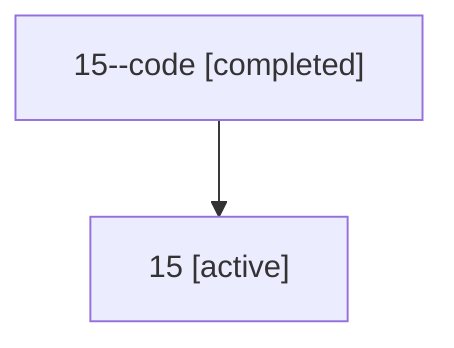

# Family: 15

[Agent Hoods](../README.md) / [bbugyi200](../users/bbugyi200/README.md) / [athena](../users/bbugyi200/machines/athena/README.md) / [15](../users/bbugyi200/machines/athena/hoods/15/README.md) / 15

Owner: `bbugyi200.athena` · Hood: `15` · Members: 2

## Lineage

The diagram is an optional enhancement; the ordered table below contains the same lineage in accessible text.

| Role | Agent | State | Model / provider | Timing | Commits | Prompt | Chat |
|---|---|---|---|---|---:|---|---|
| code | 15--code | completed | gpt-5.5 / codex | 2026-07-07T21:16:59.992431+00:00 | 0 | — | [Chat](../agents/bbugyi200.athena.15--code/chat.md) |
| root | 15 | active | gpt-5.5 / codex | 2026-07-07T21:15:57.814322+00:00 | [1](../agents/bbugyi200.athena.15/README.md#commits) | [Prompt](../agents/bbugyi200.athena.15/prompt.md) | [Chat](../agents/bbugyi200.athena.15/chat.md) |

## Commits

| Role | Repo | Commit | Subject | Committed |
|---|---|---|---|---|
| root | bob-cli | [`4cad112`](https://github.com/bobs-org/bob-cli/commit/4cad112b7e556743780e046b00f602a5e1a99c57) | chore: Add SDD prompt and plan for wip\_tasks\_dashboard | 2026-07-07 17:16:57 EDT |
| — | bob-cli | [`fea3efb`](https://github.com/bobs-org/bob-cli/commit/fea3efb28eaa291d1f8dda8364a46e4835b8471c) | chore: Mark SDD plan done | 2026-07-07 19:18:32 EDT |
