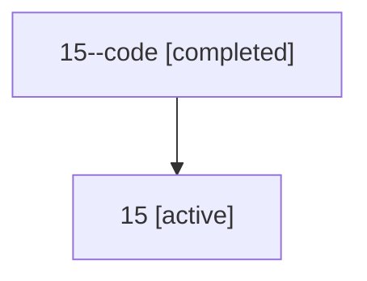

# Family: 15

Owner: `bbugyi200.athena` · Hood: `15` · Members: 2

## Lineage

The diagram is an optional enhancement; the ordered table below contains the same lineage in accessible text.

| Role | Agent | State | Model / provider | Timing | Commits | Prompt | Chat |
|---|---|---|---|---|---:|---|---|
| code | 15--code | completed | gpt-5.5 / codex | 2026-07-07T21:16:59.992431+00:00 | 0 | — | [Chat](../agents/bbugyi200.athena.15--code/chat.md) |
| root | 15 | active | gpt-5.5 / codex | 2026-07-07T21:15:57.814322+00:00 | 2 | [Prompt](../agents/bbugyi200.athena.15/prompt.md) | [Chat](../agents/bbugyi200.athena.15/chat.md) |
