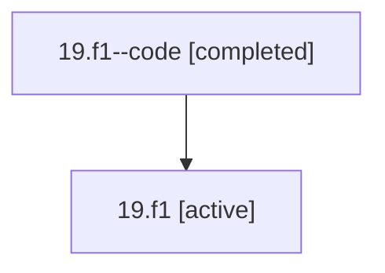

# Family: 19.f1

[Agent Hoods](../README.md) / [bbugyi200](../users/bbugyi200/README.md) / [athena](../users/bbugyi200/machines/athena/README.md) / [19](../users/bbugyi200/machines/athena/hoods/19/README.md) / 19.f1

Owner: `bbugyi200.athena` · Hood: `19` · Members: 2

## Lineage

The diagram is an optional enhancement; the ordered table below contains the same lineage in accessible text.

| Role | Agent | State | Model / provider | Timing | Commits | Prompt | Chat |
|---|---|---|---|---|---:|---|---|
| code | 19.f1--code | completed | gpt-5.5 / codex | 2026-07-07T23:27:03.786658+00:00 | 0 | — | [Chat](../agents/bbugyi200.athena.19.f1--code/chat.md) |
| root | 19.f1 | active | gpt-5.5 / codex | 2026-07-07T23:23:16.883950+00:00 | [1](../agents/bbugyi200.athena.19.f1/README.md#commits) | [Prompt](../agents/bbugyi200.athena.19.f1/prompt.md) | [Chat](../agents/bbugyi200.athena.19.f1/chat.md) |

## Commits

| Role | Repo | Commit | Subject | Committed |
|---|---|---|---|---|
| root | bob-cli | [`3d0022d`](https://github.com/bobs-org/bob-cli/commit/3d0022d874e7865766f05b057db298968216bb8e) | chore: Add SDD prompt and plan for transcluded\_at\_toggle | 2026-07-07 19:27:02 EDT |
| — | bob-cli | [`e8d5bfd`](https://github.com/bobs-org/bob-cli/commit/e8d5bfd7e83e3b776e8b4efc2256d27c509bf5eb) | chore: Mark SDD plan done | 2026-07-07 19:32:20 EDT |

## Neighbors

| Agent | Relation | State |
|---|---|---|
| [19](bbugyi200.athena.19.md) (family · 2) | ancestor | active 1, completed 1 |
| [19.f1.w1](bbugyi200.athena.19.f1.w1.md) (family · 2) | descendant | active 1, completed 1 |
| [19.f1.w1.f1](bbugyi200.athena.19.f1.w1.f1.md) (family · 2) | descendant | active 1, completed 1 |
