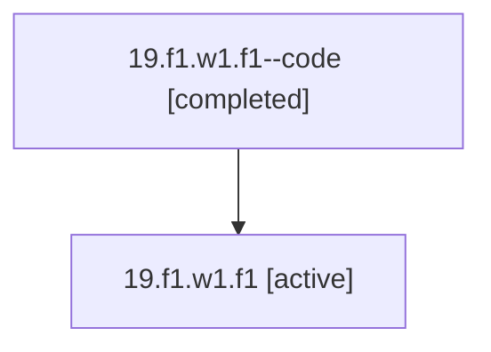

# Family: 19.f1.w1.f1

Owner: `bbugyi200.athena` · Hood: `19` · Members: 2

## Lineage

The diagram is an optional enhancement; the ordered table below contains the same lineage in accessible text.

| Role | Agent | State | Model / provider | Timing | Commits | Prompt | Chat |
|---|---|---|---|---|---:|---|---|
| code | 19.f1.w1.f1--code | completed | gpt-5.5 / codex | 2026-07-08T00:33:44.908873+00:00 | 0 | — | [Chat](../agents/bbugyi200.athena.19.f1.w1.f1--code/chat.md) |
| root | 19.f1.w1.f1 | active | opus / claude | 2026-07-08T00:11:29.588464+00:00 | 2 | [Prompt](../agents/bbugyi200.athena.19.f1.w1.f1/prompt.md) | [Chat](../agents/bbugyi200.athena.19.f1.w1.f1/chat.md) |
