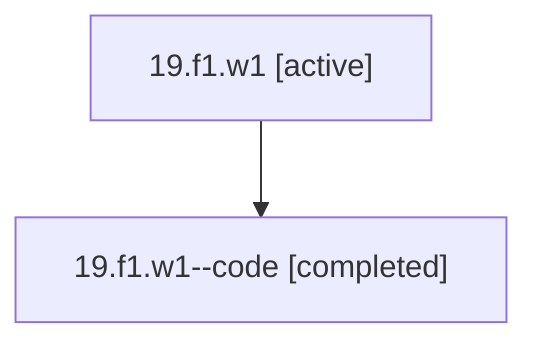

# Family: 19.f1.w1

[Agent Hoods](../README.md) / [bbugyi200](../users/bbugyi200/README.md) / [athena](../users/bbugyi200/machines/athena/README.md) / [19](../users/bbugyi200/machines/athena/hoods/19/README.md) / 19.f1.w1

Owner: `bbugyi200.athena` · Hood: `19` · Members: 2

## Lineage

The diagram is an optional enhancement; the ordered table below contains the same lineage in accessible text.

| Role | Agent | State | Model / provider | Timing | Commits | Prompt | Chat |
|---|---|---|---|---|---:|---|---|
| root | 19.f1.w1 | active | gpt-5.5 / codex | 2026-07-07T23:32:32.734129+00:00 | [1](../agents/bbugyi200.athena.19.f1.w1/README.md#commits) | [Prompt](../agents/bbugyi200.athena.19.f1.w1/prompt.md) | [Chat](../agents/bbugyi200.athena.19.f1.w1/chat.md) |
| code | 19.f1.w1--code | completed | gpt-5.5 / codex | 2026-07-07T23:39:56.196835+00:00 | 0 | — | [Chat](../agents/bbugyi200.athena.19.f1.w1--code/chat.md) |

## Commits

| Role | Repo | Commit | Subject | Committed |
|---|---|---|---|---|
| root | bob-cli | [`d6a141f`](https://github.com/bobs-org/bob-cli/commit/d6a141fd5a076e273df6ff388ffdf242717b8f8f) | chore: Add SDD prompt and plan for counted\_transclusion\_keymaps | 2026-07-07 23:39:54 UTC |
| — | bob-cli | [`cb44bd4`](https://github.com/bobs-org/bob-cli/commit/cb44bd4c6cfdaa4d1bf6192e073fbb42ae1a62c6) | chore: Mark SDD plan done | 2026-07-07 23:49:54 UTC |

## Neighbors

| Agent | Relation | State |
|---|---|---|
| [19.f1](bbugyi200.athena.19.f1.md) (family · 2) | ancestor | active 1, completed 1 |
| [19](bbugyi200.athena.19.md) (family · 2) | ancestor | active 1, completed 1 |
| [19.f1.w1.f1](bbugyi200.athena.19.f1.w1.f1.md) (family · 2) | descendant | active 1, completed 1 |
