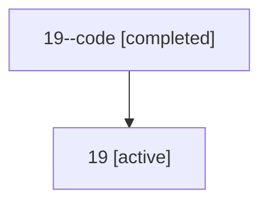

# Family: 19

[Agent Hoods](../README.md) / [bbugyi200](../users/bbugyi200/README.md) / [athena](../users/bbugyi200/machines/athena/README.md) / [19](../users/bbugyi200/machines/athena/hoods/19/README.md) / 19

Owner: `bbugyi200.athena` · Hood: `19` · Members: 2

## Lineage

The diagram is an optional enhancement; the ordered table below contains the same lineage in accessible text.

| Role | Agent | State | Model / provider | Timing | Commits | Prompt | Chat |
|---|---|---|---|---|---:|---|---|
| code | 19--code | completed | gpt-5.5 / codex | 2026-07-07T23:16:04.365064+00:00 | 0 | — | [Chat](../agents/bbugyi200.athena.19--code/chat.md) |
| root | 19 | active | gpt-5.5 / codex | 2026-07-07T23:10:29.626300+00:00 | [2](../agents/bbugyi200.athena.19/README.md#commits) | [Prompt](../agents/bbugyi200.athena.19/prompt.md) | [Chat](../agents/bbugyi200.athena.19/chat.md) |

## Commits

| Role | Repo | Commit | Subject | Committed (UTC) |
|---|---|---|---|---|
| root | bob-cli | [`2629238`](https://github.com/bobs-org/bob-cli/commit/26292384b7379f6763f57b892a8d3edf4eeb7a3d) | chore: Add SDD prompt and plan for transcluded\_task\_at\_keymap | 2026-07-07 23:16:02 |
| root | bob-cli | [`ee8791a`](https://github.com/bobs-org/bob-cli/commit/ee8791a0ee0f682a8448fec64e5334e608fb18bc) | chore: Mark SDD plan done | 2026-07-07 23:27:02 |

## Neighbors

| Agent | Relation | State |
|---|---|---|
| [19.f1](bbugyi200.athena.19.f1.md) (family · 2) | descendant | active 1, completed 1 |
| [19.f1.w1](bbugyi200.athena.19.f1.w1.md) (family · 2) | descendant | active 1, completed 1 |
| [19.f1.w1.f1](bbugyi200.athena.19.f1.w1.f1.md) (family · 2) | descendant | active 1, completed 1 |
