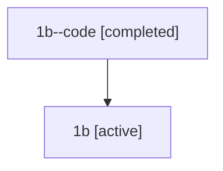

# Family: 1b

Owner: `bbugyi200.athena` · Hood: `1b` · Members: 2

## Lineage

The diagram is an optional enhancement; the ordered table below contains the same lineage in accessible text.

| Role | Agent | State | Model / provider | Timing | Commits | Prompt | Chat |
|---|---|---|---|---|---:|---|---|
| code | 1b--code | completed | gpt-5.5 / codex | 2026-07-07T23:25:03.831103+00:00 | 0 | — | [Chat](../agents/bbugyi200.athena.1b--code/chat.md) |
| root | 1b | active | gpt-5.5 / codex | 2026-07-07T23:19:58.638735+00:00 | 2 | [Prompt](../agents/bbugyi200.athena.1b/prompt.md) | [Chat](../agents/bbugyi200.athena.1b/chat.md) |
