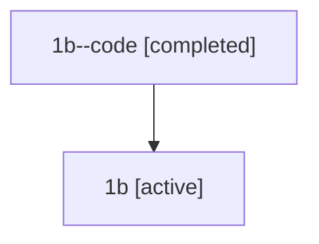

# Family: 1b

[Agent Hoods](../README.md) / [bbugyi200](../users/bbugyi200/README.md) / [athena](../users/bbugyi200/machines/athena/README.md) / [1b](../users/bbugyi200/machines/athena/hoods/1b/README.md) / 1b

Owner: `bbugyi200.athena` · Hood: `1b` · Members: 2

## Lineage

The diagram is an optional enhancement; the ordered table below contains the same lineage in accessible text.

| Role | Agent | State | Model / provider | Timing | Commits | Prompt | Chat |
|---|---|---|---|---|---:|---|---|
| code | 1b--code | completed | gpt-5.5 / codex | 2026-07-07T23:25:03.831103+00:00 | 0 | — | [Chat](../agents/bbugyi200.athena.1b--code/chat.md) |
| root | 1b | active | gpt-5.5 / codex | 2026-07-07T23:19:58.638735+00:00 | [1](../agents/bbugyi200.athena.1b/README.md#commits) | [Prompt](../agents/bbugyi200.athena.1b/prompt.md) | [Chat](../agents/bbugyi200.athena.1b/chat.md) |

## Commits

| Role | Repo | Commit | Subject | Committed |
|---|---|---|---|---|
| root | bob-cli | [`64f577f`](https://github.com/bobs-org/bob-cli/commit/64f577f831266df935cbe9af8d20162a9dc3609b) | chore: Add SDD prompt and plan for task\_query\_half\_page\_scroll | 2026-07-07 23:25:01 UTC |
| — | bob-cli | [`9417223`](https://github.com/bobs-org/bob-cli/commit/9417223b74084be2b6bc943b79a4a28af94872b9) | chore: Mark SDD plan done | 2026-07-08 16:27:57 UTC |
