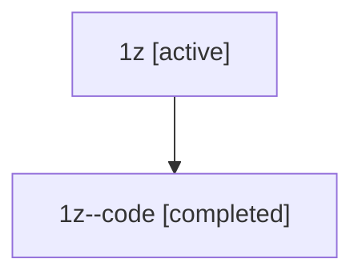

# Family: 1z

Owner: `bbugyi200.athena` · Hood: `1z` · Members: 2

## Lineage

The diagram is an optional enhancement; the ordered table below contains the same lineage in accessible text.

| Role | Agent | State | Model / provider | Timing | Commits | Prompt | Chat |
|---|---|---|---|---|---:|---|---|
| root | 1z | active | opus / claude | 2026-07-08T16:24:28.569465+00:00 | 3 | [Prompt](../agents/bbugyi200.athena.1z/prompt.md) | [Chat](../agents/bbugyi200.athena.1z/chat.md) |
| code | 1z--code | completed | gpt-5.5 / codex | 2026-07-08T16:38:06.802453+00:00 | 0 | — | [Chat](../agents/bbugyi200.athena.1z--code/chat.md) |
