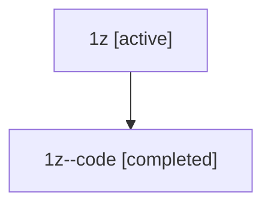

# Family: 1z

[Agent Hoods](../README.md) / [bbugyi200](../users/bbugyi200/README.md) / [athena](../users/bbugyi200/machines/athena/README.md) / [1z](../users/bbugyi200/machines/athena/hoods/1z/README.md) / 1z

Owner: `bbugyi200.athena` · Hood: `1z` · Members: 2

## Lineage

The diagram is an optional enhancement; the ordered table below contains the same lineage in accessible text.

| Role | Agent | State | Model / provider | Timing | Commits | Prompt | Chat |
|---|---|---|---|---|---:|---|---|
| root | 1z | active | opus / claude | 2026-07-08T16:24:28.569465+00:00 | [3](../agents/bbugyi200.athena.1z/README.md#commits) | [Prompt](../agents/bbugyi200.athena.1z/prompt.md) | [Chat](../agents/bbugyi200.athena.1z/chat.md) |
| code | 1z--code | completed | gpt-5.5 / codex | 2026-07-08T16:38:06.802453+00:00 | 0 | — | [Chat](../agents/bbugyi200.athena.1z--code/chat.md) |

## Commits

| Role | Commit | Subject | Committed (UTC) |
|---|---|---|---|
| root | [`fcd788f`](https://github.com/bobs-org/bob-cli/commit/fcd788f9c5b1649ddae42e8d8c0314bb61ce8f9f) | chore: Add SDD prompt and plan for refs\_base\_view | 2026-06-04 00:57:51 |
| root | [`e0eb0d4`](https://github.com/bobs-org/bob-cli/commit/e0eb0d447d6336c2efb07964c952e8fc98c9c54d) | chore: Add SDD prompt and plan for option\_bracket\_transcluded\_task\_cycle | 2026-07-08 16:38:04 |
| root | [`32bfdc2`](https://github.com/bobs-org/bob-cli/commit/32bfdc22d348fcc0daa7814f01e8a734aa4c8c0a) | chore: Mark SDD plan done | 2026-07-08 16:55:42 |
