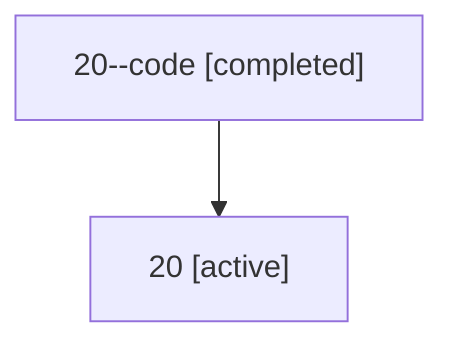

# Family: 20

[Agent Hoods](../README.md) / [bbugyi200](../users/bbugyi200/README.md) / [athena](../users/bbugyi200/machines/athena/README.md) / [20](../users/bbugyi200/machines/athena/hoods/20/README.md) / 20

Owner: `bbugyi200.athena` · Hood: `20` · Members: 2

## Lineage

The diagram is an optional enhancement; the ordered table below contains the same lineage in accessible text.

| Role | Agent | State | Model / provider | Timing | Commits | Prompt | Chat |
|---|---|---|---|---|---:|---|---|
| code | 20--code | completed | gpt-5.5 / codex | 2026-07-08T16:33:54.585239+00:00 | [1](../agents/bbugyi200.athena.20--code/README.md#commits) | — | [Chat](../agents/bbugyi200.athena.20--code/chat.md) |
| root | 20 | active | opus / claude | 2026-07-08T16:27:55.497455+00:00 | [1](../agents/bbugyi200.athena.20/README.md#commits) | [Prompt](../agents/bbugyi200.athena.20/prompt.md) | [Chat](../agents/bbugyi200.athena.20/chat.md) |

## Commits

| Role | Repo | Commit | Subject | Committed |
|---|---|---|---|---|
| — | bob-cli | [`393b41d`](https://github.com/bobs-org/bob-cli/commit/393b41d17adae316baec3e8135856fc149951187) | chore: Add SDD prompt and plan for highlights\_ref\_pdf\_block\_id | 2026-06-03 20:40:52 EDT |
| — | bob-cli | [`6efa171`](https://github.com/bobs-org/bob-cli/commit/6efa171dd125bd4ba8df42bf6b38c21af8f074b4) | feat: add PDF block ID to generated highlight refs | 2026-06-03 20:43:29 EDT |
| root | bob-cli | [`0450b17`](https://github.com/bobs-org/bob-cli/commit/0450b17e3a607c7c19fc975737e5e6e6ff41ed1c) | chore: Add SDD prompt and plan for plugins\_git\_pull | 2026-07-08 12:33:52 EDT |
| code | bob-cli | [`a552cc2`](https://github.com/bobs-org/bob-cli/commit/a552cc277e5099ef840722f3f9c6b1aae7a6fd13) | feat(plugins): refresh repo before list and sync | 2026-07-08 12:43:44 EDT |

## Neighbors

| Agent | Relation | State |
|---|---|---|
| [20.f1](../agents/bbugyi200.athena.20.f1/README.md) | descendant | completed |
| [20.f1.f1](../agents/bbugyi200.athena.20.f1.f1/README.md) | descendant | completed |
| [20.f1.f1.f1](../agents/bbugyi200.athena.20.f1.f1.f1/README.md) | descendant | completed |
