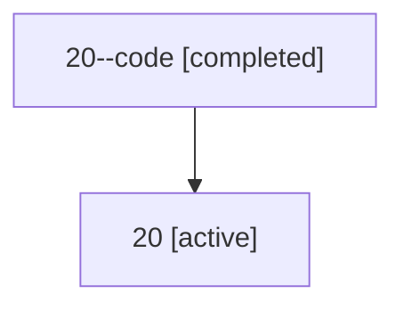

# Family: 20

Owner: `bbugyi200.athena` · Hood: `20` · Members: 2

## Lineage

The diagram is an optional enhancement; the ordered table below contains the same lineage in accessible text.

| Role | Agent | State | Model / provider | Timing | Commits | Prompt | Chat |
|---|---|---|---|---|---:|---|---|
| code | 20--code | completed | gpt-5.5 / codex | 2026-07-08T16:33:54.585239+00:00 | 0 | — | [Chat](../agents/bbugyi200.athena.20--code/chat.md) |
| root | 20 | active | opus / claude | 2026-07-08T16:27:55.497455+00:00 | 4 | [Prompt](../agents/bbugyi200.athena.20/prompt.md) | [Chat](../agents/bbugyi200.athena.20/chat.md) |
