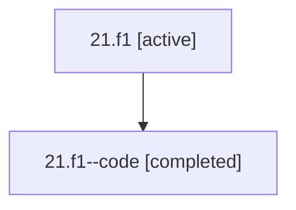

# Family: 21.f1

Owner: `bbugyi200.athena` · Hood: `21` · Members: 2

## Lineage

The diagram is an optional enhancement; the ordered table below contains the same lineage in accessible text.

| Role | Agent | State | Model / provider | Timing | Commits | Prompt | Chat |
|---|---|---|---|---|---:|---|---|
| root | 21.f1 | active | opus / claude | 2026-07-08T16:55:40.938279+00:00 | 2 | [Prompt](../agents/bbugyi200.athena.21.f1/prompt.md) | [Chat](../agents/bbugyi200.athena.21.f1/chat.md) |
| code | 21.f1--code | completed | gpt-5.5 / codex | 2026-07-08T17:04:39.969793+00:00 | 0 | — | [Chat](../agents/bbugyi200.athena.21.f1--code/chat.md) |
